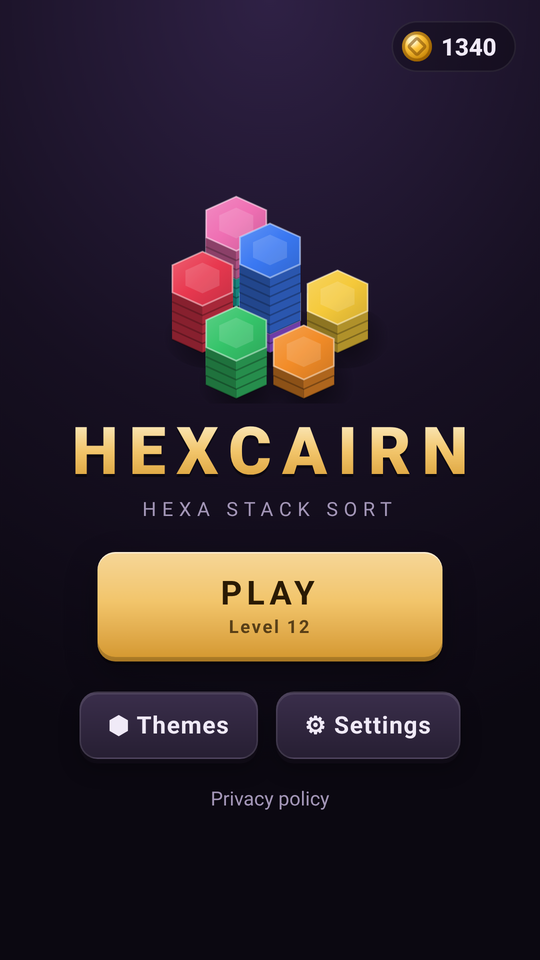
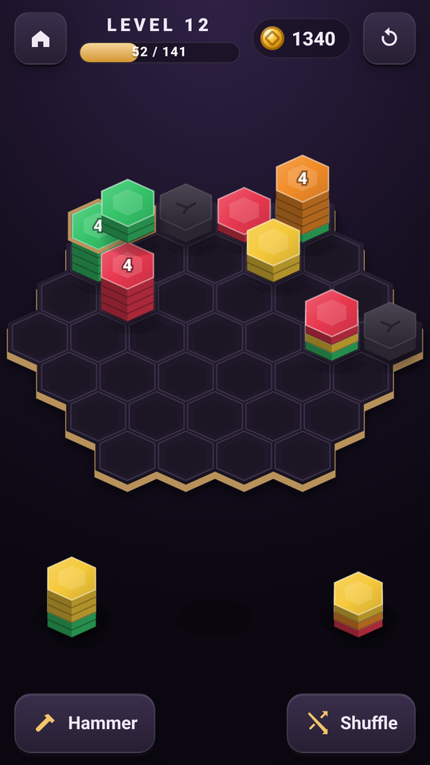
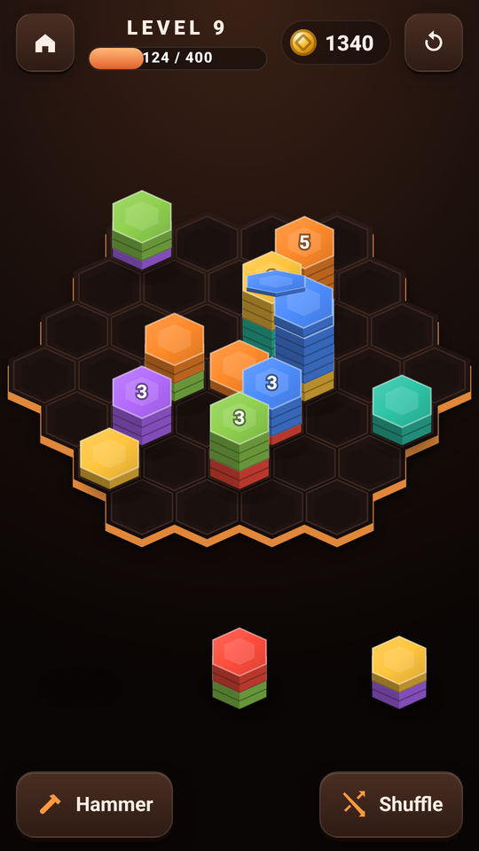
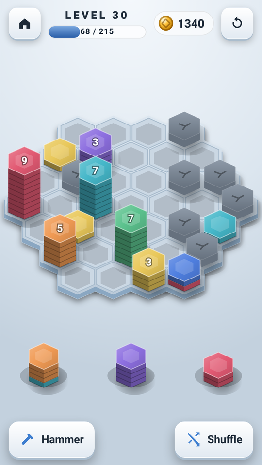

# ⬢ Hexcairn: Hexa Stack Sort

A sleek, **offline hexa stack sort puzzle**. Drop stacks of colored hex tiles onto a hex board, watch matching colors slide together in chain reactions, and merge 10 of a color to clear them. It's written in vanilla HTML/CSS/JavaScript (the 2.5D board is drawn on a canvas) with no framework, and ships as an **Android app** (Capacitor 8 + Google AdMob) that **GitHub Actions** builds and signs automatically.

**▶ Play the live demo:** https://offerpk.github.io/hexa-sort/
**Privacy policy:** https://offerpk.github.io/hexa-sort/privacy.html
**Android downloads (signed AAB/APK):** [Releases](https://github.com/OfferPk/hexa-sort/releases)

<p align="center">
  
  
  
  
</p>

## How to play

- The tray holds **3 stacks** of hex tiles. **Drag** one onto any **empty** cell of the hex board. A ghost preview snaps to the nearest empty cell and neighbouring stacks with the same top color light up.
- After the drop, the **top same-color tiles of neighbouring stacks slide together** onto one stack (the one with the most matching neighbours). Stacks that gave tiles away reveal new top colors, which can slide again: a **chain reaction**.
- Any stack whose top single-color run reaches **10 or more** tiles **merges and clears** for points (1 point per tile). The 2nd clear in the same drop scores ×2, the 3rd ×3, and so on.
- Reach the level's **target score** to win. When all 3 tray stacks are used, 3 new ones are dealt. The level is **lost when the board is full**.
- Boosters (each one ▶ a rewarded ad, **only when you tap the button**): **Hammer** (smash one stack), **Shuffle** (new tray stacks, once per tray) and **Revive** (after a loss, clears the messiest stacks, once per level).
- Completing levels earns **coins** that unlock cosmetic **themes**: Basalt, Glacier, Ember, Jade Temple and Aurora. Coins can't be bought, cashed out or used for anything else. There are no purchases and no loot boxes.

## Features

- **Endless seeded levels.** Level *N* is generated from seed *N*, so it's the same on every device. Level 1–3 use a 19-cell board; from level 4 the board has 37 cells with more **blocked cells** as you go (up to 9), **more colors** (3 → 8, +1 every 6 levels), taller and more mixed tray stacks, and a few pre-placed stacks.
- **Every level is verified winnable.** A greedy simulator (`simulate()` in `www/js/logic.js`) plays each level with the real tray generator, and the level's target is set to at most 85% of what it scores within the level's placement budget (≤ 70 drops). `npm test` re-plays **levels 1–500** and checks that each one is won within budget. This runs in CI on every push.
- **Fair tray generator.** Stacks use only the level's colors, and whenever the board has stacks next to empty cells, at least one tray stack can merge right away. The three tops are never all the same color.
- A polished 2.5D look: stacked hex prisms with side shading and soft shadows, tiles that flip and arc between stacks, burst particles and score pop-ups on clears, **WebAudio** synthesized sound effects (no audio files) and light **haptics** via `@capacitor/haptics`.
- Everything is saved in `localStorage` after every drop (level, board, tray, score, RNG state, coins, themes, settings). A color-blind aid (symbols on top tiles) plus sound and haptics toggles are in Settings.
- Sleek 13+ style: jewel-toned tiles on stone boards. No mascots, no cartoon style.
- No build step: open `www/index.html` or serve the folder.

## Project layout

```
www/                  ← the whole game (also the Capacitor webDir & the Pages site)
  index.html, css/style.css, privacy.html, icon.png
  js/logic.js         ← pure rules: hex board, merge/chain resolver, scoring, loss, seeded levels, simulator
  js/game.js          ← canvas renderer (2.5D), drag & drop, animations, persistence, shop, settings
  js/sound.js         ← WebAudio SFX
  js/themes.js        ← cosmetic theme catalog (UI + tile palettes)
  js/ads-config.js    ← ★ ALL AdMob IDs + pacing numbers live here
  js/adgate.js        ← interstitial pacing rules (pure, unit-tested)
  js/ads.js           ← UMP consent, banner, interstitial, rewarded
android/              ← Capacitor Android project (committed)
assets/               ← icon/splash generator (make_icon.py) + 512 px store icon
store/                ← Google Play listing kit (graphics, text, answers, checklist, capture scripts)
test/                 ← logic + ad-gate tests (Node) and a headless-Chrome play test
.github/workflows/    ← android.yml (signed AAB/APK + Releases), pages.yml (web demo)
```

## Run locally

```bash
npm install
npm run serve          # http://localhost:8080
npm test               # merge/chain rules, scoring, loss, generator, levels 1..500 winnable, ad pacing
```

Headless phone-size play test (drags stacks with touch and mouse events; checks merges, a chain double clear, level win and Next, board-full loss, revive, hammer, shuffle, reload persistence, and fails on any console error):

```bash
npm i --no-save puppeteer-core
PUPPETEER=puppeteer-core node test/browser.test.js http://localhost:8080/ /tmp   # Chrome at /usr/bin/google-chrome (or CHROME=...)
```

## Ads (AdMob) and the ad rules

| Hook | When | In a browser |
|---|---|---|
| `Ads.init()` | on launch: **UMP consent** + SDK init only, **no ad is shown** | no-op |
| `Ads.showBanner()` | only while the **gameplay screen** is open (adaptive banner at the bottom) | no-op |
| `Ads.maybeInterstitial(gate)` | only on **Level complete → Next level**, when `AdGate` allows it | never |
| `Ads.showRewarded(cb)` | only when the player taps **Hammer** (then a stack), **Shuffle** or **Revive**. The reward is granted only on the SDK's *earned reward* event | grants the reward immediately |

Interstitial pacing, enforced in `www/js/adgate.js` and tested in `test/adgate.test.js`:

- **None** until the player has completed **level 5** *and* played for **3 minutes** in total.
- After that, at most **one every 3 completed levels** and at most **one per 90 s**, only between levels. If an ad isn't ready, the game simply continues.
- **Never** on launch, exit or back press. There are no app-open ads, and the pacing state is saved so restarting the app doesn't reset it.

### Swapping in your real AdMob IDs

The repo uses **Google's official test IDs**. Change them in exactly **two** places:

1. **`www/js/ads-config.js`**: set `APP_ID`, `BANNER_ID`, `INTERSTITIAL_ID` and `REWARDED_ID`, then set `IS_TESTING: false`.
2. **`android/app/src/main/AndroidManifest.xml`**: set the `com.google.android.gms.ads.APPLICATION_ID` meta-data value to your real **App ID** (`ca-app-pub-XXXX~YYYY`).

Then bump the version, commit and tag. CI builds a new signed AAB. In AdMob, also publish a **Privacy & messaging → GDPR message** so the consent form appears, and add an `app-ads.txt` to your developer website.

## Android build

- Capacitor 8, appId **`com.offerpk.hexasort`**, name **Hexcairn**, plugins `@capacitor-community/admob` 8.1.0 and `@capacitor/haptics` 8.
- `compileSdk`/`targetSdk` **36**, `minSdk` **24**, versionCode **1**, versionName **1.0.0** (in `android/app/build.gradle` / `android/variables.gradle`).
- Permissions: `INTERNET`, `ACCESS_NETWORK_STATE`, `AD_ID` (AdMob) and `VIBRATE` (haptics). No billing: the game has no purchases.

### CI (GitHub Actions)

`.github/workflows/android.yml` runs on every push to `main`, on `v*` tags, and on manual dispatch: Node 22 + JDK 21 → `npm ci` → `npm test` → `npx cap sync android` → `./gradlew bundleRelease assembleRelease` → it prints the APK's `targetSdkVersion` with `aapt2` and verifies the signatures. The signed **`.aab`** and **`.apk`** are uploaded as artifacts, and a `v*` tag also creates a **GitHub Release** with both files attached. `pages.yml` deploys `www/` to GitHub Pages.

Signing uses these repository secrets (the keystore and passwords are **never** committed):

| Secret | Contents |
|---|---|
| `KEYSTORE_BASE64` | `base64 -w0 upload.jks` |
| `KEYSTORE_PASSWORD` | keystore password |
| `KEY_ALIAS` | key alias (`upload`) |
| `KEY_PASSWORD` | key password |

### Build locally

```bash
npm ci
npx cap sync android
cd android
ANDROID_KEYSTORE_FILE=/path/upload.jks KEYSTORE_PASSWORD=... KEY_ALIAS=upload KEY_PASSWORD=... \
  ./gradlew bundleRelease assembleRelease
```

### Icons and splash

`python3 assets/make_icon.py` regenerates the original launcher icons (legacy, round and adaptive foreground), the splash screens, `www/icon.png` and the 512 px store icons.

## Releasing to Google Play

See **[`store/LAUNCH-CHECKLIST.md`](store/LAUNCH-CHECKLIST.md)** (it opens with a Roman Urdu summary), [`store/listing-en.md`](store/listing-en.md) and [`store/play-console-answers.md`](store/play-console-answers.md).

1. Bump `versionCode` (+1 every upload) and `versionName`, and switch to your real AdMob IDs.
2. `git tag v1.0.1 && git push origin v1.0.1`. CI attaches `hexa-sort-v1.0.1.aab` and `.apk` to a Release.
3. Upload the `.aab` in Play Console with **Play App Signing** turned on. The CI keystore is your **upload key**.

## License

[MIT](LICENSE) © 2026 OfferPk. See also the [Privacy Policy](PRIVACY.md).
